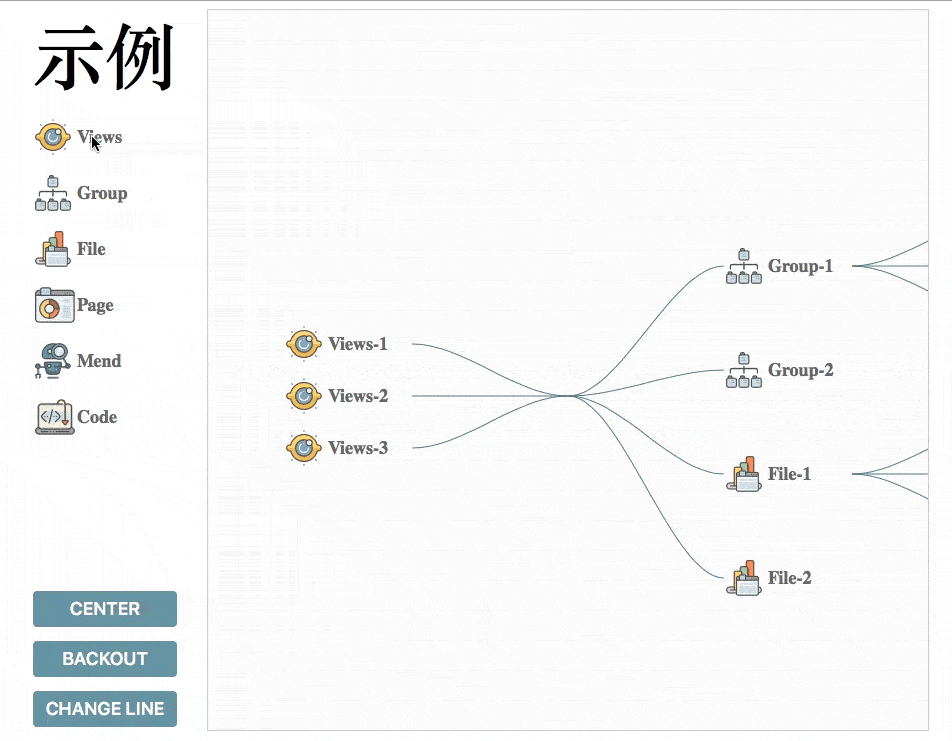
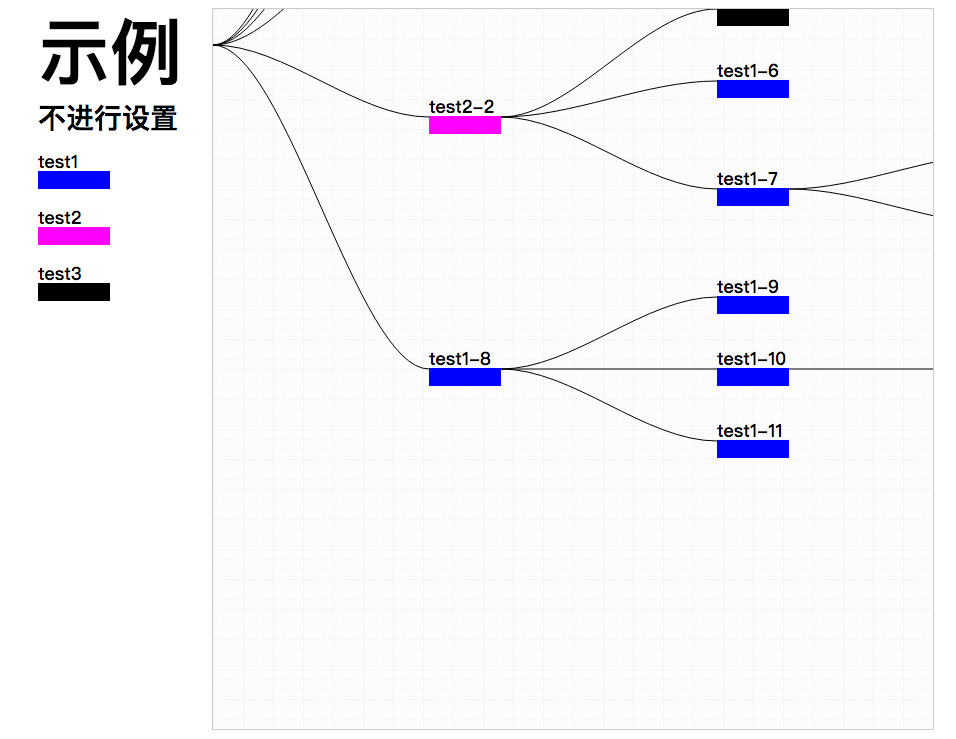

## About what is SDT.

SDT is an abbreviation for SVG Drag Tree,it's a front-end components that you could Simply drag and drop the SVG icon to generate a view with the tree structure and the corresponding data. The component doesn't depend on any other library or framework while leaving the user with  great freedom in the pattern. Therefore, the example does not represent its final style (for example, the connection can be set to a straight line). The file size of .min.js is about 13kb.

###  [Example](https://aute.github.io/SVGDragTree/)

## What SDT did?
* You don't need to worry about the elements will be stacked together because you get the size of the element automatically
* You can decide how they are placed and set the dependencies between elements 
* Straight line and curve can be chosed and you could set the line color
* The upper and lower margins between the elements are also settable, but the width between the elements will generate automatically
* The size of the target canvas is determined by the  DIVs, and you can customize the background
* Two methods are available: set up directly in HTML, or set in js
* If you do not make a setting, the component provides default settings
* Provides a global drag and zoom of the entire canvas, as well as a way back to the canvas center
* Undo or delete any element is also supproted, the rest of the elements will be re-arranged
* Two types of data can be returned : Lite and Full version. The lite only contains element type, ID, dependency to reduce the amount of data sent to the back-end, but the Lite version of the data can not be used for redraw. The Full version contains all the data contained in the Lite, and also contains drawing-related information, placing order-related information that can be used as redraw
* Yes, the method of receiving the "full version of the data" and then redrawing it is also provided(in the example, the canvas has been generated tree structure)
* When the users actions do not match your settings  a monitorable error massage will be returned

## What SDT can be used to
* For the moment, SDT has been applied to a cloud service providers in the virtual devices' arrangement.
* Perhaps to be a mind map is also good?

## Advantages of SDT
* Based on SVG, and relative to the Canvas class library inherited some of the advantages of SVG, for example, can work with CSS, DOM
* Native JS and has no any further dependency,Light-weight

## Introduction method
Introduction by &lt;script&gt;,If If the label is placed on the head, it must set to defer="defer".
If you need other JS to set up or call the component just like exampleScript.js down there, This Js file needs to be introduced after SDT.js* 
```html
<head>
	...
	<script src="SDT.js" defer="defer" type="text/javascript" charset="utf-8"></script>
	<script src="exampleScript.js" defer="defer" type="text/javascript" charset="utf-8"></script>
	...
</head>
```

In the html files, all SVG icons that can be dragged are surrounded by a <div> tag of a class = "sdt-drag-element-lis", each of which is given by a <div> label ' class = "sdt-drag-element" ' surrounded 
*Note:The label must be a data-sdt-type attribute, and the attribute value is a string that describes the type of the icon*
```html
<div class="sdt-drag-element-lis">
	<div class="sdt-drag-element" data-sdt-type="icon-1">
		<svg>...</svg>
	</div>
	<div class="sdt-drag-element" data-sdt-type="icon-2">
		<svg>...</svg>
	</div>
	<div class="sdt-drag-element" data-sdt-type="icon-3">
		<svg>...</svg>
	</div>
	...
</div>
```

In the html files, the  canvas is surrounded by a <div> tag of a class = "sdt-canvas", which determines the width and height of the target canvas. The canvas is a <svg> tag with id = "sdt-drop-canvas"
```html
<div class="sdt-canvas">
	<svg id="sdt-drop-canvas" width="100%" height="100%">...</svg>
</div>
```

## Configuration method
### Not Configured
If not configured, the component defaults elements can be placed above all elements, the default elements placed on the right side of the tree, the margins between the elements is the height of the elements themself.The elements linked by Bessel curve, color is # 999, and the center of the tree is located in the upper left corner of the canvas



### Example for not configured ： [example](https://aute.github.io/SVGDragTree/noSet.html)

### The first configuration method: Directly configured in HTML

#### Element configuration
Element configuration via data-sdt-eleset- * in the <div> (class = "sdt-drag-element") tag of each outer layer that can drag the SVG icon
* **data-sdt-eleset-dropswitch** is true or false. When the value is true, the element can be placed directly on the canvas
* **data-sdt-eleset-leanright**  is true or false. When the value is true, the element is placed on the right side of the tree by default
* **data-sdt-eleset-foresidetype** The value of data-sdt-eleset-foresidetype sepraated by ",".When the value is empty, then any element will not accept its placement; when the value is "all" when all elements are accepted; when the value is a valid type string, type string represented by the type of element will accept its placement

```html
<div class="sdt-drag-element"
data-sdt-type="icon-1"
data-sdt-eleset-dropswitch=true
data-sdt-eleset-leanright=true
data-sdt-eleset-foresidetype="icon-1,icon-2">
	<svg>...</svg>
</div>
```

#### Target canvas configuration:
Target object canvas configuration via data-sdt-eleset- * in the <div> tag for class = "svg-canvas"Configuration

* **data-sdt-eleset-lineType** The value of this element should be "straight" or "bessel" which represented for straight line or Bessel line
* **data-sdt-eleset-lineColor** The value of this element determines the color of the connection
* **data-sdt-eleset-treecenterX** The value is the center X coordinate of the number (no unit, non-string) tree
* **data-sdt-eleset-treecenterY** The value is the center  Y coordinate of the number (no unit, non-string) tree
* **data-sdt-eleset-margin** Values are numbers (without units, non-strings) of the upper and lower margins of the element

```html
<div class="svg-canvas"
data-sdt-eleset-lineType="bessel"
data-sdt-eleset-lineColor="#900"
data-sdt-eleset-treecenterX="360"
data-sdt-eleset-treecenterY="360"
data-sdt-eleset-margin="8">
	<svg id="dropCanvas" width="100%" height="100%">...</svg>
</div>
```

### The second configuration method: Configured in JS

Declare an object set_o 
*Note: SDTTreeElements is an array object, and SDTTreeSet is an object*'

```javaScript
var set_o = {
	"SDTTreeElements": [],
	"SDTTreeSet": {}
	};
```

#### Element configuration
In the array of SDTTreeElements, each item is an object, for each object:
* **type** The type attribute value is a string representing the element type
* **dropswitch** The dropswitch property value is true or false and when the value is true, the element can be placed directly on the canvas
* **leanRight** The value of the leanRight value is true or false and when the value is true, the element is placed by default on the right tree
* **foresideType** ForesideType value is an array When the array is empty, then any element will not accept its placement; when the array has an element value of "all", all elements are accepted; when the array element value is legal type, the type of corresponding The element accepts its placement

```javaScript
var set_o = {
"SDTTreeElements": [
	{
		"type": "icon-1", 
		"dropSwitch": true, 
		"foresideType": ["icon-1","icon-2"], 
		"leanRight": false
	},{
		"type": "icon-2",
		"dropSwitch": true,
		"foresideType": ["root", "icon-2"], 
		"leanRight": false
	},{
		"type": "icon-2",
		"dropSwitch": true,
		"foresideType": ["all"], 
		"leanRight": false
	}
],
"SDTTreeSet": {...}
};
```
#### Target canvas configuration:
In the SDTTreeSet object, each property:
* **lineType** The value of this element should be "straight" or "bessel" which represented for straight line or Bessel line
* **lineColor** The value of this element determines the color of the connection
* **dtreecenterX** The value is the center X coordinate of the number (no unit, non-string) tree
* **treecenterY** The value is the center  Y coordinate of the number (no unit, non-string) tree
* **treeEleMargin** Values are numbers (without units, non-strings) of the upper and lower margins of the element

```javaScript
var set_o = {
	"SDTTreeElements": [...],
	"SDTTreeSet": {
		"lineType": "bessel",
		"lineColor": "#f00",
		"treeCenterX": "360",
		"treeCenterY": "360",
		"treeEleMargin": "16"
		}
};
```

## About API
### SDT.SVGDragComponent() 
It's used to configur the components,which accept a parameter, the parameter type is the object, the object literal should conform to the format specified in "The second configuration method: Configured in JS"

```javaScript
SDT.SVGDragComponent(set_o);
```
### SDT.backCenter() 
Return to the canvas center without accepting parameters
```javaScript
document.getElementById("btn-1").addEventListener("click", function () {
	SDT.backCenter();
});
```

### SDT.removeELe() 
Delete the element, accept a new parameter, the parameter type is an array, the array element should be the id of the element to be deleted
*Note: If you do not pass in the parameters, delete the most recently placed element*
```javaScript
document.getElementById("btn-2").addEventListener("click", function () {
	var rLis =["icon-2-3","icon-3-1","icon-1-1"]
	SDT.removeELe(rLis);
});

document.getElementById("btn-3").addEventListener("click", function () {
	SDT.removeELe();
});
```

### SDT.returnTree() 
Returns a tree that accepts a parameter with a parameter of type true or false. If the value is true, it returns a concise tree (the element contains only id, name, foresideObjId, childEles information) and can not be used for redrawing; if the value is false The full tree is returned and the full tree can be used for redrawing
*Note: The redraw request has a page with icon information, that is, the corresponding class = "sdt-drag-element-lis" & lt; div & gt; tag contains the list of icons*
```javaScript
var intTree = SDT.returnTree(true);
```
### SDT.drawInputTree() 
Redraw the tree, accept a parameter, the parameter type is the full tree, the call will empty the target canvas, and immediately redraw
```javaScript
SDT.drawInputTree(intTree);
```

### SDT.dropErrorMsg
If the placement is not legal, its value will change to the most recently draged object's information, that can be placed in those types of elements after the information can be monitored by Object.defineProperty changes
```javaScript
Object.defineProperty(SDT.dropErrorMsg, 'dataDropError', {
	set: function (msg) {
		alert(msg);
	}
});
```

## Target
*  Get compatibility improved
* Code refactoring, the code is now written ugly (literally did not extract, the function is too complex, the code repetition rate is high, if nested) )
* Add unit tests
* Improve the documentation
* Include customizable information attributes and modification methods for elements
* Add animations to add / remove elements
* After the above goal is almos achieved, release SDT to npm

## known bug & compatibility issues
* Failed in IE as well as in EDGE
* Icons can not draged in nSafari, only the text part could work